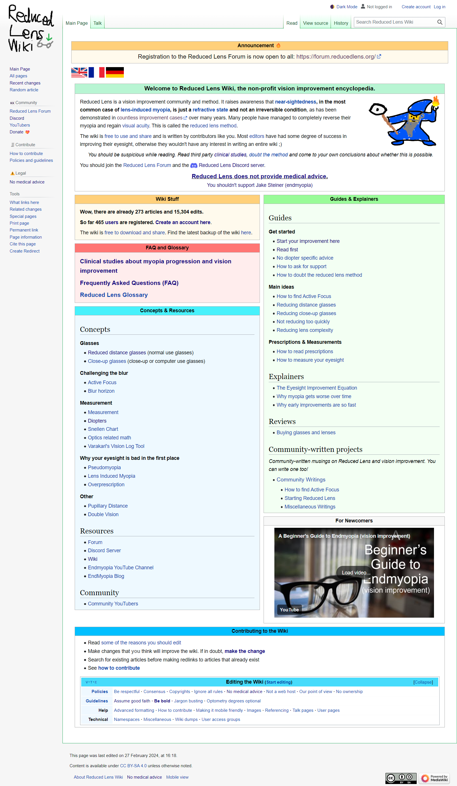

# Reduced Lens Wiki Archive
This is the state of wiki.reducedlens.org on 3 July 2024. This is before it was closed due to inactivity in editing and server costs.

## This is a lot of effort, I just want the information
You should just go to https://wiki.endmyopia.org/wiki/EndMyopia_Wiki if you can't be bothered with using this fork. It will definitely be easier than using this archive. The content of Reduced Lens Wiki did not diverge that much from EndMyopia Wiki, so you will get approximately the same information.

However keep in mind that the Reduced Lens Wiki was quite literally created in response to Jake Steiner, the owner of Endmyopia, paywalling the previously free EndMyopia Wiki, which was a community created project made by pretty much everyone except him. If the above link no longer works, then either using the [Wayback Machine](https://archive.org/) *or* using this repository with the archived files will be the best way to read the content again.

## How to use the archive
**To download the archive as a zip file, look above for the green `<> Code` button above, click it and select Download ZIP.** Then extract the file.

Everything you need is basically in the following folder:

```
Reduced Lens Wiki Archive/wiki
```

This contains all of the actual content with writings and guides inside of it, preserved as it was. **You don't need to go into any other folders.**

The root of each page, e.g. `https://wiki.reducedlens.org/wiki/Guide:Start_your_improvement_here`, is sitting the root of the `/wiki` folder. If there was a subpage for a given page, such as `https://wiki.reducedlens.org/wiki/Guide:Start_your_improvement_here/fr` (French version), then it will be in the `/wiki/Guide_Start_your_improvement` folder with the file `fr.html`.

**Please note that links on pages in the archive might not always work, you will likely have to go back to the folder containing .html files to change the page you are on.**

## Why was the live version of the website taken down?
The Reduced Lens Wiki was a fork of [EndMyopia Wiki](https://wiki.endmyopia.org/wiki/EndMyopia_Wiki). EndMyopia Wiki was created 18 May 2020, and the Reduced Lens Wiki was forked on 14 May 2023.

Nearly all of the articles on Reduced Lens Wiki were already written long before the fork. Reduced Lens Wiki, just like EndMyopia Wiki, has seen very little editing activity for a long time.

Ultimately, because the content has already been written and such a miniscule number of edits are being made, there is not much point in continuing to pay server costs for a Web 2.0 site, which needs interactivity and a server backend, when the site could just as easily be Web 1.0, which are just plain html files that contain information and can be hosted for free.

## License
This content was forked from wiki.endmyopia.org under the Creative Commons Attribution-ShareAlike 4.0 International License (CC-BY-SA 4.0). You can find the license terms here: https://creativecommons.org/licenses/by-sa/4.0/deed.en or in LICENSE.md in this repository.

